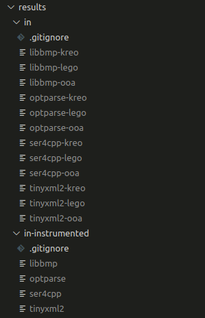

# KreO

This implements our hybrid dynamic-static technique to extract OO features from
compiled C++ binaries.

## Setup

Most of the components must run on Windows; however, the static analysis
component must be run on Linux because ROSE is only [supported on
Linux](https://github.com/rose-compiler/rose/wiki/How-to-Set-Up-ROSE). KreO has
been tested on a Ubuntu 20.04 host machine with a Windows VirtualBox VM. The
host and VM have a shared memory location, which is where KreO is located. The
install instructions assume you are running a similar setup; however, any
Windows/Linux combination with shared memory should work. If shared memory is
not available, you can transfer the relevant files from the pregame (which must
run on Linux) to the Windows machine. When reproducing results, all data in
`./data` is `.gitignore`'ed except for the files that are generated on Linux so
you can transfer them easily after running the pregame on Linux. Run
`./data/clean_pregame.sh` to remove the data generated by the pregame from the
`./data` directory.

### Windows

The following tools should be installed on the Windows machine.

#### Python

Python is required on Windows and there are a few Python packages required to
run the project.

1. Install python 3.10. You may prefer pypy for performance.
1. Create a virtualenv inside of the project directory by running `python -m
   venv .venv`. To use a specific python executable (such as pypy), use that as
   the python executable with which you create the venv.

	If your operating system is running an older version of python, you may wish
   to use conda instead of virtualenv, because conda makes it easy to install
   custom python versions.
1. Activate the virtualenv with `.\.venv\Scripts\activate.bat`.
1. Install dependencies by `pip3 install -r requirements.txt`.

#### Pintool

Pin is required for dynamic analysis.

1. Download a recent Pin version from [Intel's
   website](https://www.intel.com/content/www/us/en/developer/articles/tool/pin-a-binary-instrumentation-tool-downloads.html).
   Most of our testing was on Pin 3.25. Make sure you download pin for MSVC.
1. Install [Cygwin](https://www.cygwin.com). When selecting packages to install,
   make sure to add `make` in addition to the default selections.
1. Install a recent version of [Microsoft Visual Studio with
   C++](https://visualstudio.microsoft.com/vs/features/cplusplus/)
1. Open up the "x86 Native Tools Command Prompt for VS" to build for 32-bit.
1. Add the Cygwin binary directory to your path. Usually something like `set
   PATH=%PATH%;C:\cygwin64\bin`. Make sure to use MSVC linker instead of GNU
   linker utility.
1. Set the `PIN_ROOT` environment variable to inside the extract Pin directory,
   *using forward slashes*. For example, `set PIN_ROOT=C:/Users/Mark/pin`.
1. Run `make` from inside the `pintool` directory of KreO.

#### Evaluation (optional)

If you wish to evaluate KreO, you must build the evaluation tools. cmake must be
installed. You *must* use cmake installed with MSVC and not cywin. If `which
cmake` returns `/usr/bin/cmake.exe` or similar, you should specify the MSVC
cmake using it's full path (something like `"C:\Program Files\Microsoft Visual
Studio\2022\Community\Common7\IDE\CommonExtensions\Microsoft\CMake\CMake\bin\cmake.exe"`).

Install the latset boost version. Note that you should run [additional
steps](https://stackoverflow.com/a/72696051) in Visual Studio after
downloading/unzipping Boost to ensure libraries are built. After installing,
ensure the environment variable `BOOST_ROOT` is set to the root of your Boost
installation.

In the `evaluation` directory, run:

```mkdir build && cd build && cmake ..```

Next, open the `build` directory in explorer and open the
`analyze_pdb_dump.vcxproj` file with Microsoft Visual Studio. Build the project
in Visual Studio (<kbd>ctrl</kbd>+<kbd>shift</kbd>+<kbd>B</kbd>). When building,
ensure the file `build\Debug\analyze_pdb_dump.exe` exists.

### Linux

#### ROSE

ROSE is required for static analysis. Follow instructions on the [ROSE
wiki](https://github.com/rose-compiler/rose/wiki/How-to-Set-Up-ROSE) to install
ROSE. We recommend (and have tested with) [installing ROSE from
source](https://github.com/rose-compiler/rose/wiki/Install-Rose-From-Source). It
is critical that `--enable-languages=binaries` is specified when building ROSE.
Also when installing ROSE specify `/usr/local` for the install directory.

#### Pregame

In the `pregame` directory run `make` to build the pregame. Note that ROSE must
be installed before building the pregame.

#### OOAnalyzer (optional)

To compare KreO to OOAnalyzer, you may want to install OOAnalyzer. This can be
done in a container or on your Linux machine. Refer to OOAnalyzer's [install
instructions](https://github.com/cmu-sei/pharos/blob/master/INSTALL.md) for
installation information. 

## Running

There are three steps:

1. Initial static analysis, where procedure boundaries and other preliminary
   information is collected.
1. Dynamic analysis, where the program is actually run.
1. Final static analysis, where un-executed code paths are analyzed using
   constant propagation. The raw output from the dynamic analysis step is also
   be processed.

A few more steps exist when performing evaluation.

Configuration is controlled by a JSON file instead of command-line arguments.
All three parts take as their only argument a path to the JSON configuration,
which in turn contains paths to other intermediate files created by stages 1 and
2.

An example configuration file with commented documentation is available at
`arguments.example.json`.

Now, for how to actually run the stages:

When running on Windows, you first **must** run `pregame.py` on Linux (after
running `make` in the `pregame` directory), then on Windows run
`run_pipeline_evaluation.bat` to run dynamic analysis and the final postgame
analysis. `run_pipeline_evaluation.bat` will run all the evaluation steps in
addition to just running KreO. If you just want to run KreO without evaluation,
run `run_pipline.bat` after running `pregame.py`. These scripts take in a single
argument, the path to the JSON file that contains user specified parameters.
Also make sure `PIN_ROOT` is set as described in the setup above.

The final output is a JSON file containing OO features in a structured format
and is located in the `base_directory` specified in the JSON configuration file.

### Running Lego re-implementation vs. KreO

As a baseline, we re-implemented an approach called
[Lego](https://research.cs.wisc.edu/wpis/papers/cc14.pdf). Additional static
analysis features and other improvements are built on top of this
re-implementation. To specify the tool to run, use the `analysis_tool` JSON key.
Valid tools are `kreo`, `lego_plus`, and `lego`. `lego` is the base Lego re-implementation.
`lego_plus` includes no additional static analysis, but does include some improvements
during the rest of analysis. `kreo` includes the improvements in `lego_plus` as
well as additional static analysis.

### Generating LaTeX results

After running the evaluation pipeline, all results should be in the
`evaluation/results` directory. Results should be labeled by project name, with
`-kreo`, `-lego`, or `-ooa` appended to the end of each file. For example, the
following results are from running the evaluation on libbmp, optparse, ser4cpp,
and tinyxml2:



To compile the results into usable LaTeX tables, run
`evaluation/results/generate_result_tables.py`.

### Reproducing Results

Included in the project is all the data required for reproducing the results for
the paper associated with KreO. This includes all the JSON configuration files
required for the projects evaluated as well as the executables and PDB files so
you don't have to deal with building the projects yourself. All relevant data is
in the `data` directory.

Note that you must download and place the `resources` directory from
[tinyxml2](https://github.com/leethomason/tinyxml2/tree/master) in the project's
base directory, as well as `xmltest.cpp`.

The shell script `data/run_all_pregame.sh` must be run on Linux first (from the
project's base directory). Then, the batch script `data/run_all.bat` will run
all the Windows-side evaluation scripts for all evaluated projects.

After running Lego and KreO on all projects, run the
`data/run_all_evaluation.bat` (from the project's base directory), then run
`evaluation/results/generate_result_tables.py`
